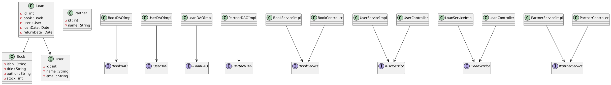
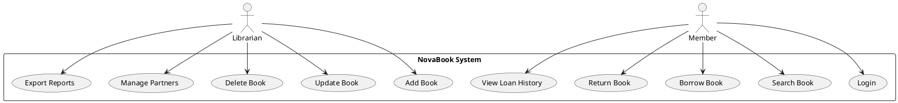

# NovaBook

NovaBook is a **Java-based library management system** designed to handle book inventory, user management, and loan operations in a structured and modular way.  
This project follows a **multi-layer architecture** that separates responsibilities into controllers, services, data access objects (DAO), models, and views — ensuring clarity, scalability, and maintainability.

---

##  Overview

NovaBook provides the fundamental features of a digital library system:
- User and partner management
- Book registration and search
- Loan and return operations
- Data persistence layer with DAOs
- Error handling through custom exceptions
- Configurable application setup and logging utilities

It was designed as an academic and practical demonstration of software design patterns, especially **MVC (Model–View–Controller)** combined with **DAO (Data Access Object)**.

---

##  Project Structure

```
src/main/java/
├── app/
│   └── MainApplication.java
├── controller/
│   ├── BookController.java
│   ├── LoanController.java
│   ├── PartnerController.java
│   └── UserController.java
├── dao/
│   ├── IBookDAO.java
│   ├── ILoanDAO.java
│   ├── IPartnerDAO.java
│   ├── IUserDAO.java
│   ├── BookDAOImpl.java
│   ├── LoanDAOImpl.java
│   ├── PartnerDAOImpl.java
│   └── UserDAOImpl.java
├── exception/
│   ├── BusinessException.java
│   ├── ExistingISBNException.java
│   ├── InsufficientStockException.java
│   └── InvalidPartnerException.java
├── model/
│   ├── Book.java
│   ├── Loan.java
│   ├── Partner.java
│   └── User.java
├── service/
│   ├── IBookService.java
│   ├── ILoanService.java
│   ├── IPartnerService.java
│   ├── IUserService.java
│   └── impl/
│       ├── BookServiceImpl.java
│       ├── LoanServiceImpl.java
│       ├── PartnerServiceImpl.java
│       └── UserServiceImpl.java
├── util/
│   ├── AppLogger.java
│   ├── ConfigLoader.java
│   ├── CSVExporter.java
│   └── DBConnection.java
└── view/
    ├── BookView.java
    ├── ExportView.java
    ├── LoanView.java
    ├── LoginView.java
    ├── PartnerView.java
    ├── PrincipalMenuView.java
    ├── UIHelper.java
    └── UserView.java
```

---

## Architecture

NovaBook follows a **layered MVC + DAO** structure:

| Layer | Description |
|-------|--------------|
| **Controller** | Manages requests from the user interface and delegates logic to the service layer. |
| **Service** | Contains business logic and coordinates DAO and model operations. |
| **DAO (Data Access Object)** | Handles direct interaction with the database (CRUD). |
| **Model** | Defines the entities such as `Book`, `User`, `Partner`, and `Loan`. |
| **View** | Represents the user interface layer (console-based). |
| **Util** | Utility and helper classes for configuration, logging, exporting, and database connection. |

This architecture promotes **separation of concerns**, **testability**, and **ease of maintenance**.

---

##  UML Diagrams

### Class Diagram (PlantUML)



---

### Use Case Diagram (PlantUML)



---

## Getting Started

### Prerequisites

- Java 11+
- Maven 3+
- An IDE (IntelliJ IDEA, Eclipse, VS Code with Java extensions)

### Run the Project

1. Clone the repository:
   ```bash
   git clone https://github.com/Pegasso-admon/NovaBook.git
   cd NovaBook
   ```
2. Build the project:
   ```bash
   mvn clean install
   ```
3. Run the main class:
   ```bash
   java -cp target/NovaBook.jar app.MainApplication
   ```

---

##  Technologies Used

- **Java** — main programming language
- **Maven** — dependency management and build automation
- **PlantUML** — for UML diagrams
- **JDBC** (via `DBConnection`) — database interaction
- **Custom logging and utilities** — for configuration and export

---

##  Contributing

1. Fork the repository
2. Create your feature branch (`git checkout -b feature/YourFeature`)
3. Commit using [Conventional Commits](https://www.conventionalcommits.org/en/v1.0.0/)
4. Push and open a Pull Request

---

###  Authors

Developed by the **Pegasso muerte** as part of a software architecture and development project.  
This repository showcases layered design principles and modular Java programming.